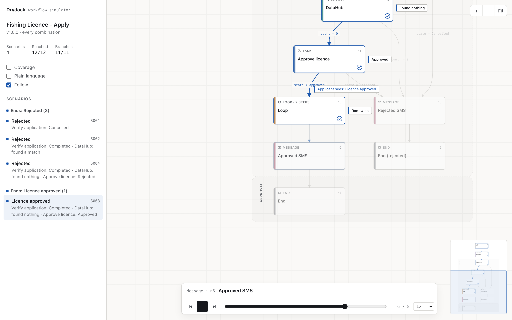

# Drydock

Run OneGov workflows on your own machine before they go anywhere near a live environment.

Testing a workflow today means creating real instances in a shared environment, completing tasks by hand and reading legs to see what happened. Drydock loads an exported workflow and runs it locally from a case file: the applicant's answers, each officer's decision, what a DataHub lookup returns, whether the invoice gets paid. Nothing is created anywhere, and every run can be repeated.

The aim is to show every case a workflow can take, not just the ones someone remembered to test, in a form you can walk an agency through.

## Status

Early. Milestones 1 to 6 of 7 are done.

- [x] **Loader.** Reads govcraft exports: single-file exports, the compact review snapshot, and review bundle folders. Bundles are the only format that includes loop children.
- [x] **Expression V2 engine.** Lexer, parser and evaluator for expressions and transition conditions, all documented functions, and the live engine's quirks: references pasted in before parsing, string values double quoted, missing references failing on Expression V2 and blanking elsewhere. What is documented and what is inferred is in [SEMANTICS.md](SEMANTICS.md).
- [x] **Lint.** Checks every expression and condition without running anything.
- [x] **Simulator.** Runs a case file through a workflow step by step: tasks, lookups, loops (including `currentIndex` and sibling reads), payments, status changes. Stops with a plain reason when the case is waiting on an answer, a node has no matching transition, or the engine would fail the instance.
- [x] **Replay.** Checks Drydock against a real recorded instance: same route, same expression text after substitution, same values.
- [x] **Every path.** Explores every way a case can go, in parallel, and reports the distinct scenarios, branch coverage and grouped findings.
- [x] **Viewer.** One self-contained page that draws the workflow and plays each scenario on it.
- [ ] govcraft integration

## Try it

```bash
go run ./cmd/drydock inspect testdata/licence-bundle
go run ./cmd/drydock lint testdata/licence-bundle
go run ./cmd/drydock view testdata/licence-bundle testdata/cases/submission.yaml -o licence.html
go run ./cmd/drydock dot testdata/licence-bundle > licence.dot
```

`run` plays a case through the workflow:

```bash
go run ./cmd/drydock run testdata/licence-bundle testdata/cases/approved.yaml
go run ./cmd/drydock run testdata/licence-bundle testdata/cases/undecided.yaml   # stops and says what it needs
```

A case file holds what the platform would get from outside: the submission, each officer's decision, what each lookup finds, whether invoices are paid.

```yaml
name: approved, no existing licence
submission:
  attributes: {island: Male, boats: [{name: Blue Fin}, {name: Sea Star}]}
  meta: {user_identifier: A123456}
tasks:
  n2: {state: Completed}
  n4: {state: Approved, form: {approval-form: {remarks: ok}}}
lookups:
  n3: []                          # rows the lookup finds
  n5/lm1: [[], [{id: 7}]]         # inside a loop: one result per iteration
payments: {n17: paid}
```

Anything the case leaves out is reported, never guessed: a task with no decision stops the run and lists the answers its transitions check, and a lookup with no rows is noted. Guessing is how a test suite ends up only ever taking the happy path.

Replaying the same past workflow with two cases shows the outage `lint` found: an applicant already in the registry passes, and one who is not fails at the exact expression the live engine failed on.

`view` turns an exploration into one HTML page that plays it:

```bash
go run ./cmd/drydock view testdata/licence-bundle testdata/cases/submission.yaml -o licence.html
```



The workflow appears first as a skeleton, card by card. Pick a scenario and a token runs it: each node lights while it runs and is ticked when it is done, the transition it takes lights up, and the moments that decide the route are called out on the diagram (the officer approved, the lookup found nothing, the loop ran twice, the status the applicant now sees). Failures turn red where the engine would fail and say why. Branches the scenario did not take step back.

- Problems are listed first, then scenarios grouped by how they end. It opens on the first problem, or on the longest way through that ends well.
- Play, pause, step, scrub and change speed; the camera follows the token. Space, the arrow keys and F work too.
- **Coverage** shows how many scenarios pass each step and marks branches nothing takes.
- **Plain language** hides node ids and condition labels for walking an agency through it.
- Everything is inline (layout by [dagre](https://github.com/dagrejs/dagre), MIT), so the page works offline and can be sent as a file. Light and dark follow the system; motion is off for people who ask for reduced motion.

`paths` finds every way a case can go through a workflow, from just a submission:

```bash
go run ./cmd/drydock paths testdata/licence-bundle testdata/cases/submission.yaml
```

```
Fishing Licence - Apply v1.0.0: 4 scenarios from 7 runs on 8 workers in 1ms

COMPLETED (4)
  S001  n2: officer Cancelled                                              Rejected
  S002  n2: officer Completed · n3: lookup finds a row                     Rejected
  S003  n2: officer Completed · n3: lookup finds nothing · n4: officer Approved   Licence approved
  S004  n2: officer Completed · n3: lookup finds nothing · n4: officer Rejected   Rejected

coverage: 12/12 nodes, 11/11 transitions
```

How it works:

- **Decisions are found lazily.** In explore mode the simulator never guesses. It stops at the exact point an unknown matters (an officer's decision, a form field a condition reads, whether a lookup finds a row, how many rows a form list has) and offers the options worth trying: the values the workflow compares against, the platform's partner state (Approved with Rejected), and an `(other)` value to catch branches with no else.
- **Only answers that can matter are branched on.** A static analysis follows every value backwards from transition conditions and loop collections. A decision is explored only if it can change the route, or make the instance fail (lookup rows read bare, or nested in quotes). Everything else gets one representative answer.
- **Two modes.** `all` tries every combination. `each` tries every answer to every decision at least once, across all runs, which grows with the number of distinct answers instead of their combinations. The default, `auto`, tries `all` within a run budget and falls back to `each`, saying so.
- **Parallel and deterministic.** Each level of the search runs on a fixed pool of workers, then results are combined in a fixed order at a barrier. The same workflow gives the same report on 1 worker or 32; the tests check it. A timeout stops cleanly and the report says it is incomplete.
- **Findings are grouped by cause.** Hundreds of scenarios hitting the same broken expression are one finding, with the shortest scenario that reproduces it.

On three past versions of real government service workflows, `paths` found, from a bare submission:

- the expression that stopped every application from a person not yet in a registry (all 24 outputs of one node)
- the same node in an older version failing for everyone who *was* in the registry
- a branch typed `== "undefined"` where `"True"` was meant, so an application listing ten children gets stuck
- two conditions on the same node checking different fields (`medication6exists` and `condition6exists`), so one combination matches neither
- fourteen conditions still reading the previous version of a form, which the task no longer submits

`replay` is how Drydock earns trust. Give it a workflow, an instance's context and its legs (both from govcraft), and it rebuilds the case, runs it, and compares three things with what the engine recorded:

- the **route**, node by node
- every **expression after substitution**, character for character against the engine's `leg_data`
- every **computed value**, against the value the engine pasted wherever a later node used it

```bash
go run ./cmd/drydock replay testdata/licence-bundle testdata/recordings/approved.context.json testdata/recordings/approved.legs.json
```

Context snapshots are often older than the legs, because answers get corrected and steps rerun. Replay handles that. The values the engine actually used are read back out of `leg_data`. Where the route proves an answer differs from the snapshot (a task that went down the approved branch while the snapshot says rejected), the answer is corrected and reported.

On a real 26-leg recorded run, replay matched the route on all 26 legs, the text of 94 of 94 expressions, and 35 of 35 computed values. Getting there turned up three engine behaviours the documentation does not describe. They are listed in [SEMANTICS.md](SEMANTICS.md).

`lint` checks every expression and transition condition for the patterns that have broken live services:

- a lookup row read inside `ifCondition` on a node that can run after an empty lookup. The guard cannot help, because references are pasted in before parsing. Drydock walks the graph, so a node gated on the lookup count is not flagged.
- a reference inside a double-quoted literal, which fails the parse
- `'$.{ref}' == 'Yes'`, which is never true on the live engine
- an output reading a later output of its own node
- `+` used to join text, and comparisons with `null`
- a reference to a form version the task no longer submits (`$.n5.form-v2.x` when n5 submits form-v3)

Run against a past version of a real government service workflow, `lint` found, in under a second, the 24 expressions behind an outage that stopped every application, a defect seven end-to-end runs had not reached.

`inspect` prints a summary and the problems it can see in the graph alone:

- nodes no case can reach
- nodes a case can reach but never leave
- loop children missing from the export
- nodes with more than one unconditional way out

`testdata` holds a small made-up workflow, a fishing licence application. Real exports contain agency configuration and are kept out of the repo. To run the tests against your own, list them in `DRYDOCK_REAL`:

```bash
DRYDOCK_REAL="path/to/export.json:path/to/bundle" go test -run TestRealExports -v ./workflow
```

## Notes on the export format

- Node indexes (`n12`) are creation order, not run order. Drydock follows transitions.
- Loop children run in the loop's `actions` order and have no transitions of their own. Their short indexes (`l1`, `lm1`) are only unique inside the loop, so they are also addressable as `n274/lm1`.
- Empty maps arrive as `[]` or `null` from PHP and load as empty maps.
- Inactive transitions are ignored and reported.
